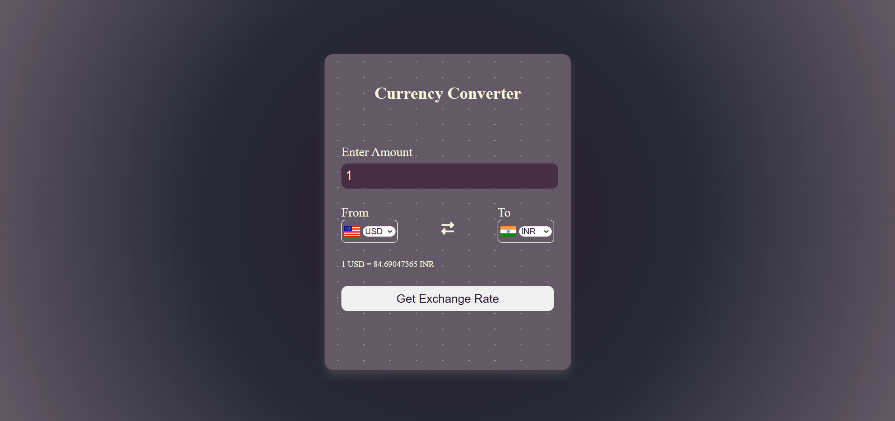
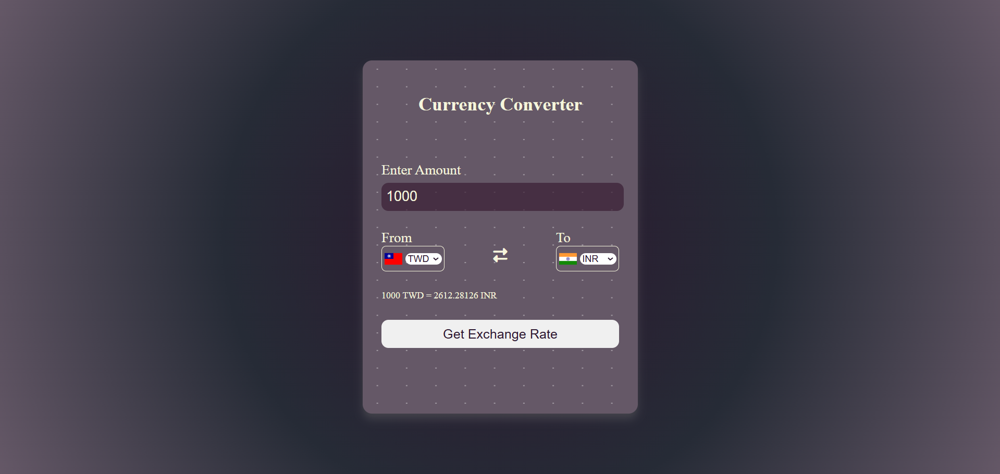

# 💱 Currency Converter

A user-friendly **Currency Converter** that utilizes a real-time API to fetch and display exchange rates dynamically. The project supports flag updates and bi-directional currency conversion for seamless user interaction.

---

## 🌟 Features

- **Real-Time Exchange Rates**: Fetches up-to-date rates from the [Currency API](https://github.com/fawazahmed0/currency-api).
- **Dynamic Dropdowns**: Automatically generates currency lists and updates flags accordingly.
- **Responsive UI**: Simple and intuitive design optimized for all devices.
- **Default Selections**: Pre-selected currencies (USD to INR) for quick conversions.
- **Effortless Conversions**: Real-time results with a single click.

---

## 🛠️ Technologies Used

- **HTML**: To structure the web page.
- **CSS**: For styling and layout.
- **JavaScript**: For handling dynamic dropdowns, fetching API data, and managing user interactions.
- **Font Awesome**: For icons used in the UI.
- **Currency API**:
  - **Base URL**: `https://cdn.jsdelivr.net/npm/@fawazahmed0/currency-api@latest/v1/currencies`
  - Provides exchange rates for supported currencies.

---

## 🚀 How to Run

1. Clone this repository:
   ```bash
   git clone https://github.com/sinha001/currency-converter.git
   ```

2. **Navigate to a Specific Level**:
    ```bash
    cd currency-converter
    ```
3. **Open the `@index.html` file in your browser**: 
    ```bash
    open index.html
    ```

---

# Project Structure
```bash
currency-converter/ 
|
├── index.html    # Main HTML file 
├── style.css     # CSS for styling 
├── app.js        # JavaScript for dropdowns and flags 
├── codes.js      # JavaScript for API handling and exchange logic 
├── screenshots/  # Folder containing screenshots of the app 
└── README.md     #Project documentation
```

---

## 📸 Screenshots  
### Converter Interface  
  

### Conversion Example  
 

---

## 📧 Contact
Feel free to reach out if you have any questions or suggestions!  
**Email**: [nishantsinha.referral@gmail.com](mailto:nishantsinha.referral@gmail.com)  
**GitHub**: [sinha001](https://github.com/sinha001)

---

## 🌟 Future Enhancements

- Add a Swap Button to reverse "From" and "To" currencies instantly.
- Include a Favorites List for commonly used currencies.
- Display Historical Exchange Rates for selected currency pairs.

---

## ✨ Convert currencies easily and explore seamless web app development! 🚀

```markdown

### Steps:
1. Save this content in a file named `README.md` in your project folder.
2. Ensure your project has a `screenshots/` folder with relevant screenshots for the app.
3. Replace the placeholder paths for screenshots (`./screenshots/interface.png`, etc.) with actual file paths if applicable.
4. Commit and push the `README.md` file to your repository on GitHub.

Let me know if further adjustments are needed! 😊
